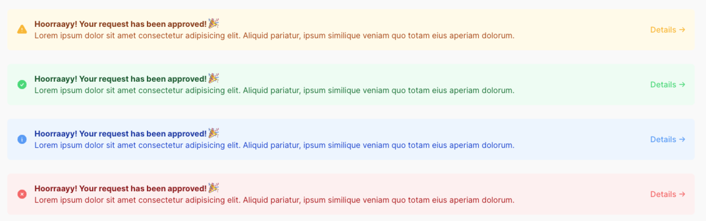

# Filament Simple Alert

[](https://packagist.org/packages/codewithdennis/filament-simple-alert)
[](https://github.com/codewithdennis/filament-simple-alert/actions?query=workflow%3A"Fix+PHP+code+styling"+branch%3Amain)
[](https://packagist.org/packages/codewithdennis/filament-simple-alert)

This package provides a simple alert components for your Filament application.

## Installation

You can install the package via composer:

```bash
composer require codewithdennis/filament-simple-alert
```

Make sure you add the following to your `tailwind.config.js` file.

```php
'./vendor/codewithdennis/filament-simple-alert/resources/**/*.blade.php',
```

## Usage

The
alerts
can
be
used in your`infolists`
or`forms`, make
sure
you
pick
the
right
component.

    ```php

use CodeWithDennis\SimpleAlert\Components\Infolists\SimpleAlert;

```

```php
use CodeWithDennis\SimpleAlert\Components\Forms\SimpleAlert;
```

### Simple Alerts

There are 4 types of simple alerts: `danger`, `info`, `success`, and `warning`.

```php
use CodeWithDennis\SimpleAlert\Components\Infolists\SimpleAlert;

SimpleAlert::make()
    ->danger()
    ->info()
    ->success()
    ->warning()
```

If you would like to use a [different color](https://filamentphp.com/docs/3.x/support/colors), you can use the `color` method.

```php
use CodeWithDennis\SimpleAlert\Components\Infolists\SimpleAlert;

SimpleAlert::make()
    ->color('purple')
```

### Icon

By default, all simple alerts will have an icon. If you would like to change the icon, you can use the `icon` method.

```php
use CodeWithDennis\SimpleAlert\Components\Infolists\SimpleAlert;

SimpleAlert::make()
    ->color('purple')
    ->icon('heroicon-s-users')
```

### Title

You can add a title to the alert by using the `title` method.

```php
use CodeWithDennis\SimpleAlert\Components\Infolists\SimpleAlert;

SimpleAlert::make()
    ->title('Hoorraayy! Your request has been approved! 🎉')
```

### Description

You can add a description to the alert by using the `description` method.

```php
use CodeWithDennis\SimpleAlert\Components\Infolists\SimpleAlert;

SimpleAlert::make()
    ->description('This is the description')
```

### Link

You can also add a link to the alert by using the `link` method.

```php
use CodeWithDennis\SimpleAlert\Components\Infolists\SimpleAlert;

SimpleAlert::make()
    ->info()
    ->link('https://filamentphp.com'),
```

If you would like to customize the link label, you can use the `linkLabel` method.

```php
use CodeWithDennis\SimpleAlert\Components\Infolists\SimpleAlert;

SimpleAlert::make()
    ->info()
    ->link('https://filamentphp.com')
    ->linkLabel('Read more!'),
```

If you would like the link to open in a new tab, you can use the `linkBlank` method.

```php
use CodeWithDennis\SimpleAlert\Components\Infolists\SimpleAlert;

SimpleAlert::make()
    ->info()
    ->link('https://filamentphp.com')
    ->linkBlank(),
```

### Example

```php
use CodeWithDennis\SimpleAlert\Components\Infolists\SimpleAlert;

SimpleAlert::make()
    ->success()
    ->title(new HtmlString('<strong>Hoorraayy! Your request has been approved! 🎉</strong>'))
    ->description('Lorem ipsum dolor sit amet consectetur adipisicing elit.')
    ->link('https://filamentphp.com')
    ->linkLabel('Read more!')
    ->linkBlank(),
```

### Screenshots




## Contributing

Please see [CONTRIBUTING](.github/CONTRIBUTING.md) for details.

## Credits

- [CodeWithDennis](https://github.com/CodeWithDennis)
- [All Contributors](../../contributors)

## License

The MIT License (MIT). Please see [License File](LICENSE.md) for more information.
